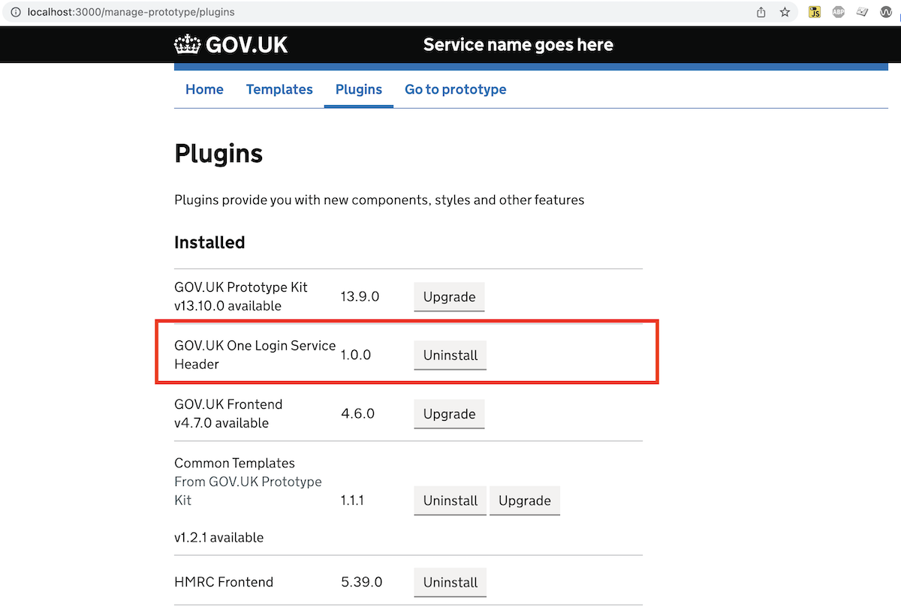
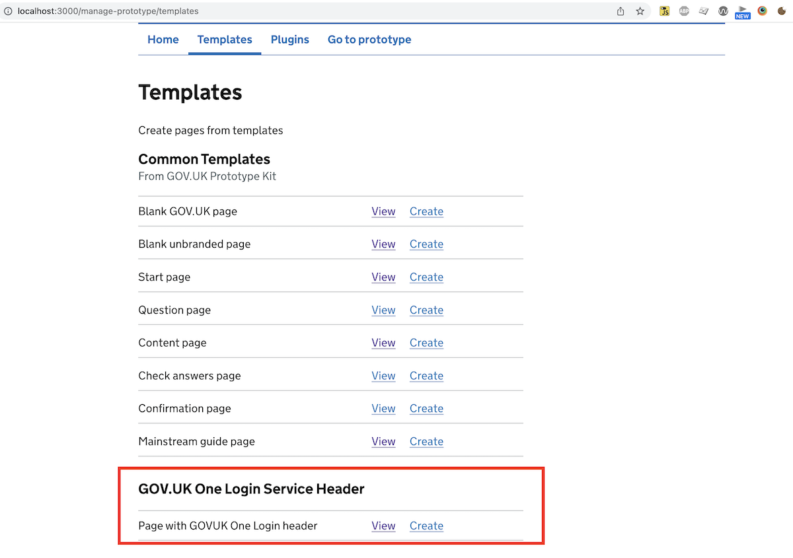

# How to install the header if you are using the Prototype Kit

## Install the header plugin 
Before you [start the kit](https://prototype-kit.service.gov.uk/docs/install/how-to-run-the-kit), run `npm install github:alphagov/di-govuk-one-login-service-header` in your terminal. 

(Note: if you are using a Mac and seeing an error along the lines of `xcrun: error: invalid active developer path (/Library/Developer/CommandLineTools), missing xcrun at: /Library/Developer/CommandLineTools/usr/bin/xcrun.`, try running `xcode-select --install` before you run the `npm install` command above)

Now the header should appear in the list of installed plugins under the `/manage-prototype/plugins` page in your prototype. 

Note that once the header has been added to the list of available plugins published by the Prototype Kit team, you will be able to install the header by simply clicking the **Install** button on the `/manage-prototype/plugins` page.

## Create a page from the pre-existing template

To create a page in your prototype using a pre-built template containing the header, navigate to `/manage-prototype/templates` and create a new page from the "Page with GOVUK One Login header" template.

To set the service name that is displayed in the header, use the following syntax: <code>&lbrace;&percnt; set serviceName = "My example service name" &percnt;&rbrace;</code>.

To set the list of navigation links , use the following syntax:
<pre><code>
&lbrace;&percnt; set navigationItems = [
  {
    href: "#",
    text: 'Example link 1',
    id: 'id1'
  },{
    href: "#",
    text: 'Example link 2',
    id: 'id2'
  },{
    href: "#",
    text: 'Example link 3',
    id: 'id3'
  }]
&percnt;&rbrace; 
</code></pre>
The fields indicate as follows:
- `href` indicates the link destination, 
- `text` is the text being displayed, 
- `id` this should be a unique identifier as it is used to set the active link

To set the currently active link which indicates the page the user is currently on, use the following syntax <code>&lbrace;&percnt; set activeLinkId = "id3" &percnt;&rbrace;</code>. The value of `activeLinkId` must match the id of one of the objects in the `navigationItems` array.

To overwrite the destination for the GOV.UK link in the header, use <code>&lbrace;&percnt; set homepageLink = "https://example.service.gov.uk/" &percnt;&rbrace;</code>. The link goes to "https://www.gov.uk/" by default.

To overwrite the destination for the One Login link in the header, use <code>&lbrace;&percnt; set oneLoginLink = "https://example.service.gov.uk/" &percnt;&rbrace;</code>. The link goes to "https://home.account.gov.uk/" by default.

Add the `set` statements listed above after the `extends` line at the top of the file.

## Use the header component in an existing page or template

If instead of using the template installation described above, you want to include the header component into one of your existing layouts or templates, the component can be imported using the syntax: 
<code>&lbrace;&percnt; from "di-govuk-one-login-service-header/service-header.njk" import govukOneLoginServiceHeader &percnt;&rbrace;</code>

The component can then be used like so: 
<pre><code>
&lbrace;&percnt; block header &percnt;&rbrace;
  &lbrace;&lbrace; govukOneLoginServiceHeader({
    serviceName: "My example service name",
    navigationItems: [{
      href: "#",
      text: 'service link 1',
      id: 'servicelink1'
    },{
      href: "#",
      text: 'service link 2',
      id: 'servicelink2'
    },{
      href: "#",
      text: 'service link 3',
      id: 'servicelink3'
    }],
    activeLinkId: 'servicelink3'
  }) &rbrace;&rbrace;
&lbrace;&percnt; endblock &percnt;&rbrace;
</code></pre>